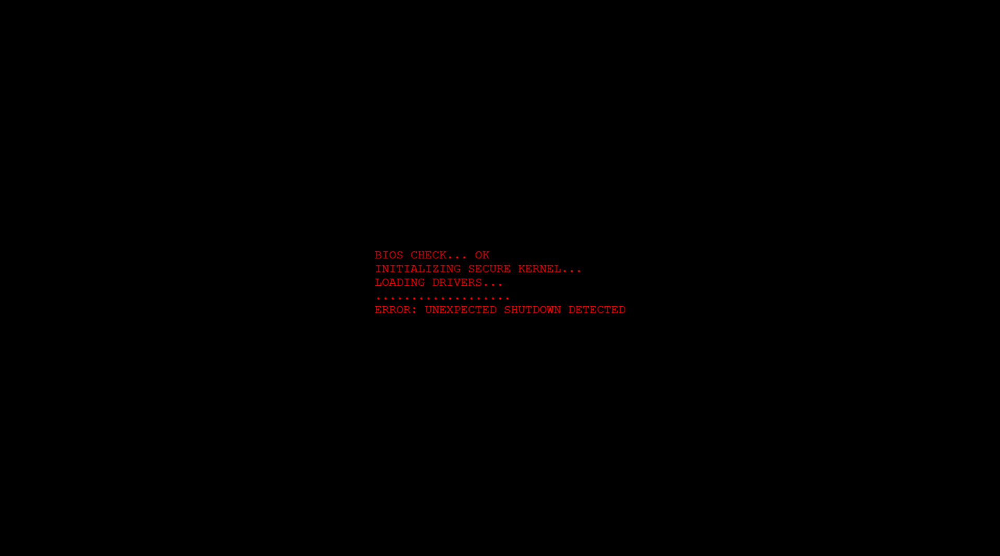
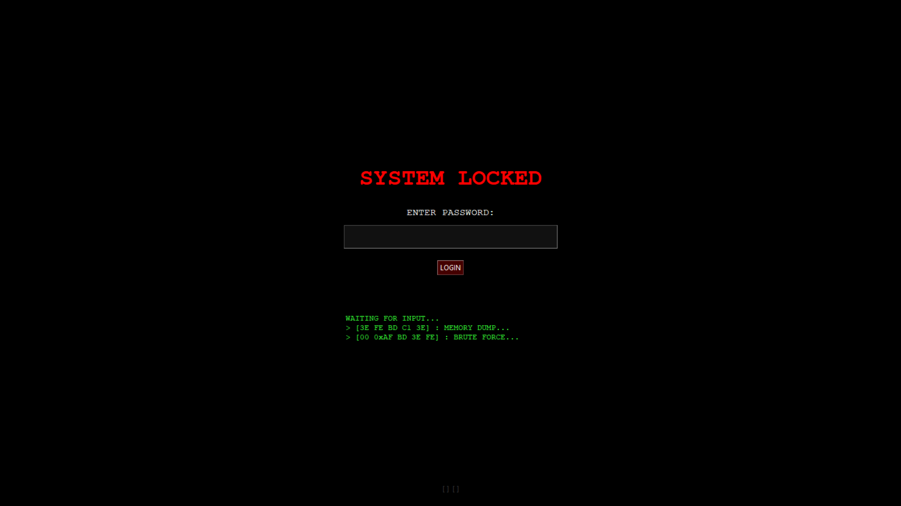
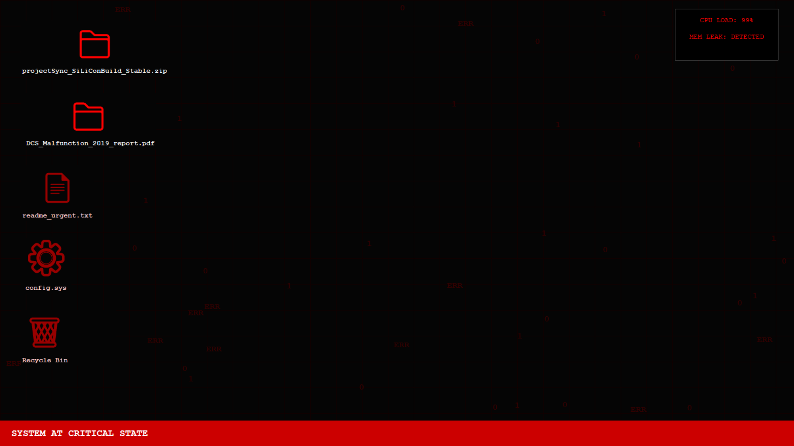
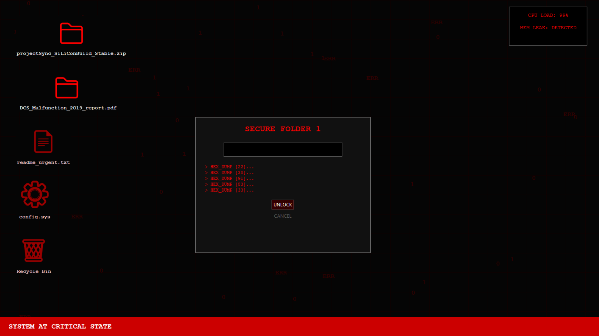
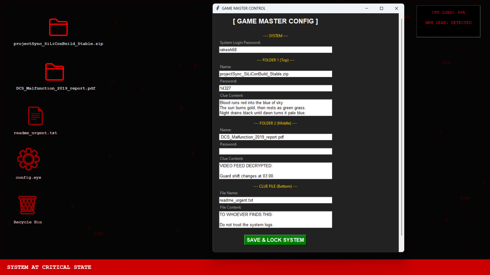
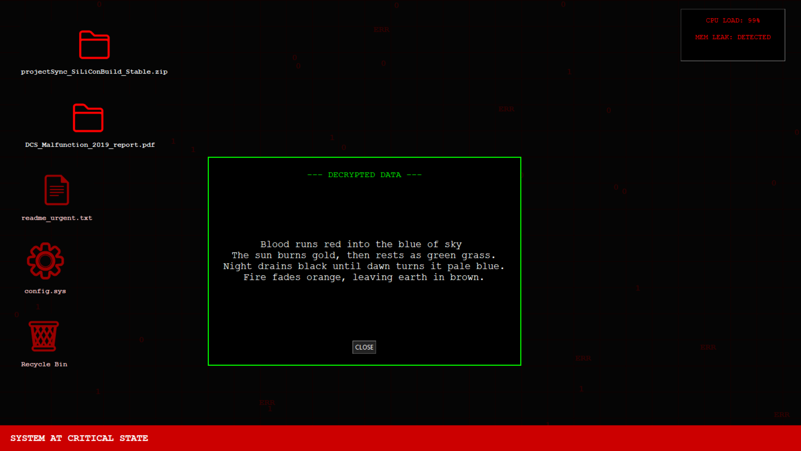

# critical-system-ui-simulator
Interactive fake-OS environment built for story-driven cyber puzzles, ARGs, and escape room PCs, complete with layered security systems and dramatic failure states.
# 🔴 Critical System UI Simulator

A cinematic cyber-terminal style interface designed for puzzle games, escape rooms, or hacking-themed simulations.

This project recreates a dramatic system failure environment complete with:

- BIOS boot errors
- Locked system login screens
- Secure folder encryption
- CPU overload warnings
- Memory leak alerts
- Decryption popups
- Game Master configuration panel

The goal is to provide a reusable interactive UI framework for story-driven cyber investigations.

---

## 📸 Screenshots

## 📸 Screenshots

### Boot Sequence Failure


### Locked System Login


### System in Critical State


### Secure Folder Unlock Panel


### Game Master Configuration Panel


### Decrypted Clue Window



## 🧠 Concept

The simulator is built to mimic a compromised industrial or security system where players must:

- Analyze logs
- Crack encrypted folders
- Interpret poetic clue files
- Unlock system layers
- Recover corrupted data
- Stop cascading failures

Perfect for:

- Puzzle games  
- Escape room PCs  
- ARG-style events  
- Cybersecurity demos  
- Story prototypes  

---

## 🛠️ Features

- Multi-stage system states
- Fake OS environment
- Password-protected folders
- Hex dump clues
- GM override panel
- Live system diagnostics
- Atmospheric UI design

---

## 🚀 How to Run

1. Clone the repo:

```bash
git clone https://github.com/yourusername/critical-system-ui-simulator.git
cd critical-system-ui-simulator
